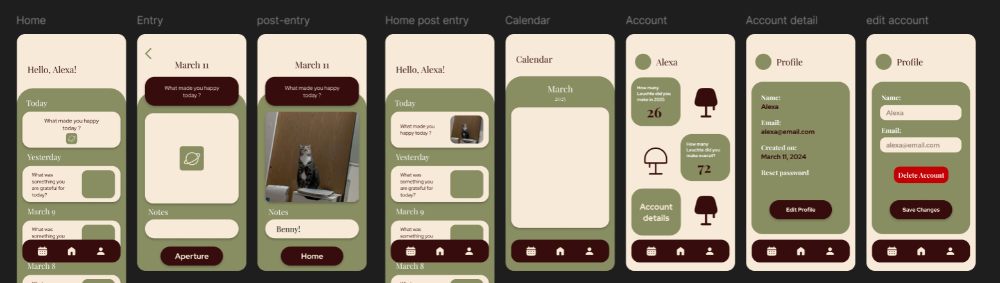

# Aperture

## Overview

This is a wellness daily entry app to reflect on your day! Each day, the app will give you a reflective prompt about your day and you have to submit a photo as an answer to the daily prompt.

### Problem Space

This application is not a necessity for most people, but it can help users improve their perspective on life. Many of us are so focused on getting things done in our lives, constantly stressed, that we end up feeling burned out. This app allows users to spend less than 5 minutes a day actively reflecting on the positive aspects of their day. It serves as a tool to help users build a good habit of thinking positively about their lives, even in small ways. Over time, it encourages us to appreciate the little things and realize that life isn’t as bad as we might thought it to be.

### User Profile

Anyone who would like to start relfecting on their days.

### Features

- Personalized user experience by having user accounts
- Randomized daily prompt for users to reflect on their day
- Daily prompt are answered with one photo! (with the option to add note)
- Display most recent entries on Home Page

## Implementation

### Tech Stack

Frontend

- React Native
- Typescript

Backend

- Node.js
- Express.js

Database & File Storage

- PostgreSql
- Supabase

Authentication

- JWT

Testing

- POSTMAN

### APIs

- Customized database

### Sitemap

Landing screen: starting screen for first time user and a bit about the application(nav)-> Login Screen
Login Screen: login page for existing users, directed to create account screen if new user (nav)-> Home screen, Create Account Screen
Create Account Screen: Create new account, add (post) new user to database (nav) -> Login Page

Home Page: display the most recent entry and today's prompt (nav) -> new entry, individual card page
Entry Page: upload photo for prompt of the day (nav) -> individual card page, back (to home page)
Indiviudal card page: shows that specific day entry, with prompt, photo, and notes (nav) -> home page
Edit Individual card page: edit that specific day entry, with prompt, photo, and notes (nav) -> home page

Account detail page: shows the user's name, email, and logout

### Mockups

### Data

User: id, email, password (hashed), createdAt
Prompt: id, text, date
Photo: id, userId, promptId, imageUrl, date, note, prompt

### Endpoints

Auth

- GET /auth
- POST /auth/signup

Prompt

- GET /prompt/today
- GET /prompt

Photos

- POST /photo/add-photo
- GET /photo/today
- GET /photos/user/entries
- POST /photo/edit

Users

- GET /user
- get /users/logout

## Roadmap

Frontend

- set up frontend folders and github
- React Routing and navigation
- Create folder structure
- Home page
  - photo card components
  - daily prompt entry
- Calendar Page
  - make days with entry clickable to individual entry screen
- Account Page
  - edit account page
  - delete module screen
  - account page statistics
- navigation bar
- entry page
- individual entry page

- Starting, Login, signup page

Backend

- set up backedn folders and github
- Users Authentication
  - user authentication (JWT)
  - store token (httponly, secure, same-site cookie)
  - logins: GET /auth/login
- Prompt
  - get daily prompts: GET /prompt/today
- Photos
  - fetch users photo entries: GET /photos
  - photo entry: POST /photos/upload
  - get recent entry: GET /photos/recent
  - get individual photo: GET /photos/:photoId
  - edit entry: PUT /photos/:photoId
  - get calendar entry: GET /photos/calendar
- Users
  - create user: POST /user
  - get user data: GET /users/me
  - update user data: PUT /users/me
  - reset password: PUT /users/me/password
  - delete user: DELETE /users/me

Database & File storage

- set up databases
- set up firebase file storage
- add prompts to prompt database
- connect database to backend
- connect photo files to database

---

## Future Implementations

- Calendar page: display what days had photo entry, and can click into it to it's individual card page
- Edit profile page: can edit name, email, icon, and option to delete account nav -> delete module, account detail page
- Account page: showcase some account stats navigate to account - detail page (nav) -> account detail page
- Connect with other users, and be able to see other's entry!
- Calendar showcase days with entry, user can click into it to see the specific day entry
