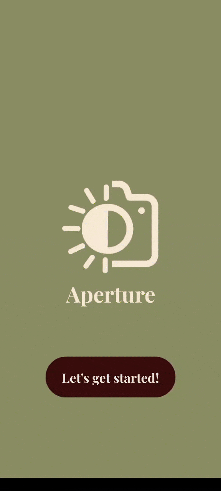
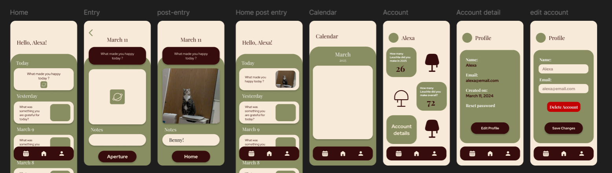

# Aperture

## Overview

This is a wellness daily entry app to reflect on your day! Each day, the app will give you a reflective prompt about your day and you have to submit a photo as an answer to the daily prompt.

### Problem Space

This application is not a necessity for most people, but it can help users improve their perspective on life. Many of us are so focused on getting things done in our lives, constantly stressed, that we end up feeling burned out. This app allows users to spend less than 5 minutes a day actively reflecting on the positive aspects of their day. It serves as a tool to help users build a good habit of thinking positively about their lives, even in small ways. Over time, it encourages us to appreciate the little things and realize that life isn’t as bad as we might thought it to be.

### User Profile

Anyone who would like to start relfecting on their days.

### Features

- Personalized user experience by having user accounts
- Daily prompts fetched from a list based on date
- Daily prompt are answered with one photo! (with the option to add note)
- Display most recent entries on Home Page

### Demo

Preview

[Demo video](https://youtube.com/shorts/M2u_dW_dzdM)

### Tech Stack

#### Frontend

- React Native
- Typescript

#### Backend

- Node.js
- Express.js

#### Database & File Storage

- PostgreSql
- Supabase

#### Authentication

- JWT

#### Testing

- POSTMAN

### APIs

- Customized database

### Mockups

### Data

- User: id, email, password (hashed), createdAt
- Prompt: id, text, date
- Photo: id, userId, promptId, imageUrl, date, note, prompt

### Endpoints

#### Auth

- GET /auth
- POST /auth/signup

#### Prompt

- GET /prompt/today
- GET /prompt

#### Photos

- POST /photo/add-photo
- GET /photo/today
- GET /photos/user/entries
- POST /photo/edit

#### Users

- GET /user
- get /users/logout

## Future Implementations

- Calendar page: display what days had photo entry, and can click into it to it's individual card page
- Edit profile page: can edit name, email, icon, and option to delete account nav -> delete module, account detail page
- Account page: showcase some account stats navigate to account - detail page (nav) -> account detail page
- Connect with other users, and be able to see other's entry!
- Calendar showcase days with entry, user can click into it to see the specific day entry
